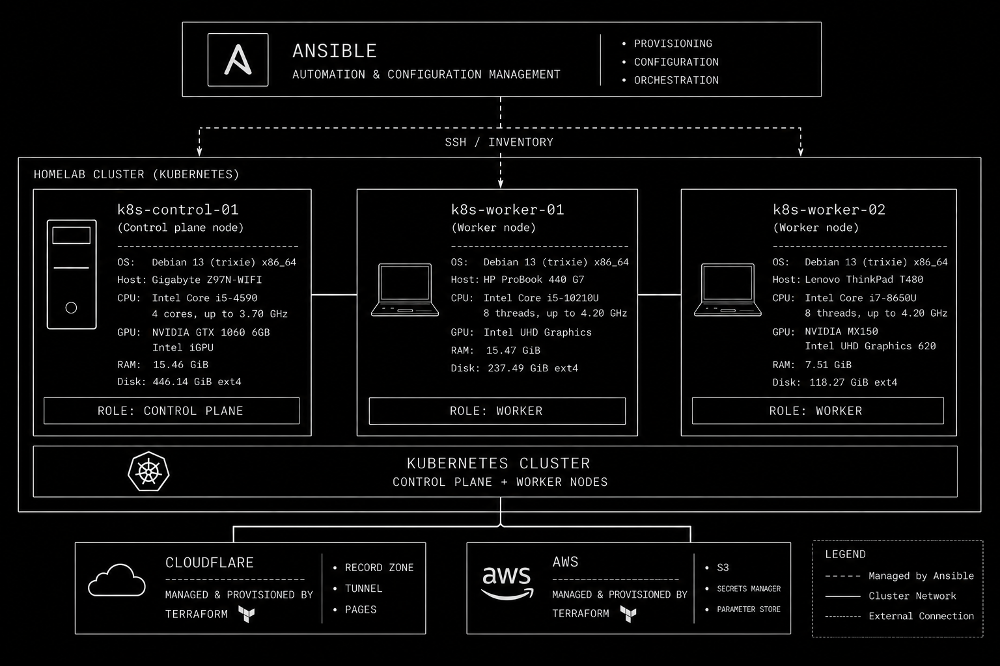

# Homelab Infra

This repository contains host bootstrap and supporting infrastructure code for the homelab.

It is separate from the Kubernetes GitOps repositories. This repo is for preparing machines and external support services; Kubernetes manifests remain in the GitOps source-of-truth repos.

## Architecture Overview



The diagram shows the current homelab support architecture. Ansible is the main automation layer for provisioning, configuration, and orchestration over SSH using the inventory. The Kubernetes cluster is composed of one control plane node, `k8s-control-01`, and two worker nodes, `k8s-worker-01` and `k8s-worker-02`.

External support services are managed separately with Terraform. Cloudflare provides DNS, the Kubernetes tunnel, and Pages resources, while AWS provides support services such as S3, Secrets Manager, and Parameter Store. Kubernetes application manifests remain outside this repository in the GitOps source-of-truth repos.

## Scope

Current and planned areas:

- `autoinstall-os/`: Debian automated installer ISO builder using preseed.
- `ansible/`: host configuration and Kubernetes bootstrap automation.
- `terraform/`: AWS and Cloudflare support infrastructure.

## Repository Layout

```text
infra/
  README.md
  .gitignore
  autoinstall-os/
    README.md
    build-iso.sh
    preseed.cfg
  ansible/
    README.md
    inventory/
    playbooks/
    roles/
  terraform/
    README.md
    aws/
      README.md
      *.tf
    cloudflare/
      README.md
      *.tf
```

`autoinstall-os/`, `ansible/`, `terraform/aws/`, and `terraform/cloudflare/` are currently implemented.

## What Belongs Here

- Bare-metal/bootstrap automation.
- Debian autoinstall assets.
- Ansible playbooks and roles for host configuration.
- Terraform for external support infrastructure such as AWS secrets and backup buckets.
- Terraform for Cloudflare DNS, tunnel remote config, and Pages projects.
- Operational documentation for the bootstrap flow.

## What Does Not Belong Here

- Kubernetes GitOps manifests.
- Application manifests.
- Generated installer ISOs.
- Terraform state files.
- Secrets, private keys, kubeconfigs, or local environment files.

## Git Hygiene

The repository ignores generated and sensitive files, including:

- `*.iso`
- `autoinstall-os/dist/`
- `autoinstall-os/work/`
- `.terraform/`
- `*.tfstate`
- `*.tfvars`
- `.env*`
- private keys and certificate bundles

`autoinstall-os/preseed.cfg` contains an `ops` password hash and an authorized SSH public key. Treat this repository as private, or rotate the password hash before publishing it elsewhere.

Before committing, always review:

```sh
git status
git diff --cached
```

## Autoinstall OS

The current implemented workflow is in `autoinstall-os/`.

```sh
cd autoinstall-os
./build-iso.sh
```

The Debian netinst ISO must be downloaded manually and placed next to `build-iso.sh`, or passed explicitly:

```sh
./build-iso.sh /path/to/debian-amd64-netinst.iso
```

Generated output is ignored by Git:

```text
autoinstall-os/dist/debian-autoinstall-ops.iso
```

## Ansible

The Kubernetes host bootstrap workflow is in `ansible/`.

```sh
cd ansible
ansible-playbook site.yaml --limit k8s-worker-02 --check
```

See `ansible/README.md` for the full worker-only test, temporary single-node control plane test, full cluster bootstrap, and Argo CD addon steps.

The current validated Ansible path can bootstrap `k8s-worker-02` as a temporary single-node Kubernetes 1.36 control plane with Cilium and Argo CD. The normal target topology remains one PC control plane plus two laptop workers.

## Terraform Cloudflare

Cloudflare support resources are managed from `terraform/cloudflare/`.

```sh
cd terraform/cloudflare
terraform init
terraform plan
```

This stack uses `CLOUDFLARE_API_TOKEN` from the environment and the S3 backend key `infra/cloudflare/terraform.tfstate`.

It imports the existing healthy `homelab-k8s` tunnel and keeps `config_src = "cloudflare"` so tunnel remote config remains managed by Cloudflare/Terraform without rotating the Kubernetes `cloudflared` token.

Current Cloudflare resources:

- `*.rubenspensky.com` points to the Kubernetes Cloudflare Tunnel.
- `frontend-demo` is the first Cloudflare Pages project.
- `frontend-demo.rubenspensky.com` is a specific Pages hostname that overrides the wildcard DNS record.

Pages deployments are handled outside Terraform through the Cloudflare Pages Git integration. Terraform defines the Pages project, DNS records, and custom domain, while Cloudflare builds and deploys the frontend directly from the connected Git repository.

For future static sites, keep Terraform responsible for Pages projects, DNS, and custom domains, and keep the Git-connected Pages project or CI/CD responsible for build and deploy.

## Terraform AWS

AWS support resources are managed from `terraform/aws/`.

```sh
cd terraform/aws
terraform init
terraform plan
```

This stack uses the S3 backend key `infra/aws/terraform.tfstate` and creates AWS resources used by the cluster and its backup/secret workflows.

Current AWS resources:

- S3 backups bucket: `homelab-backups-<aws-account-id>`, intended for Velero backups.
- Secrets Manager secret containers, including Cloudflare tunnel, GitHub ARC app, and S3 backup credentials.
- SSM Parameter Store secure parameters for cluster passwords and service configuration values.
- IAM users and scoped policies for S3 backups and secret reads.

Terraform creates the containers and access policies, but secret values and IAM access keys are created outside Terraform so they do not land in Terraform state.
